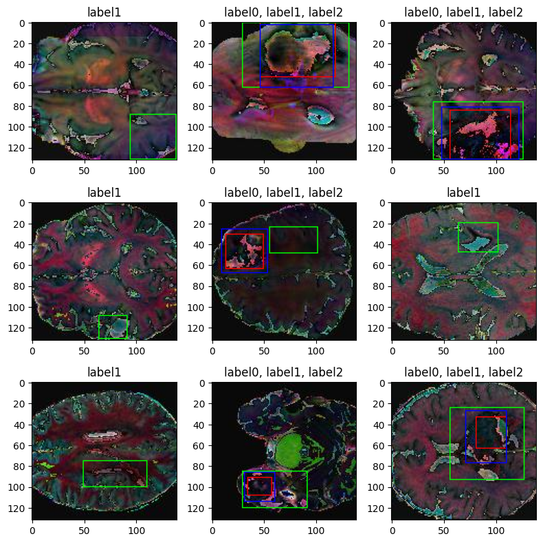
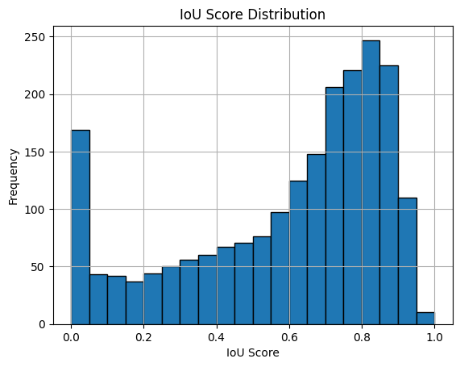
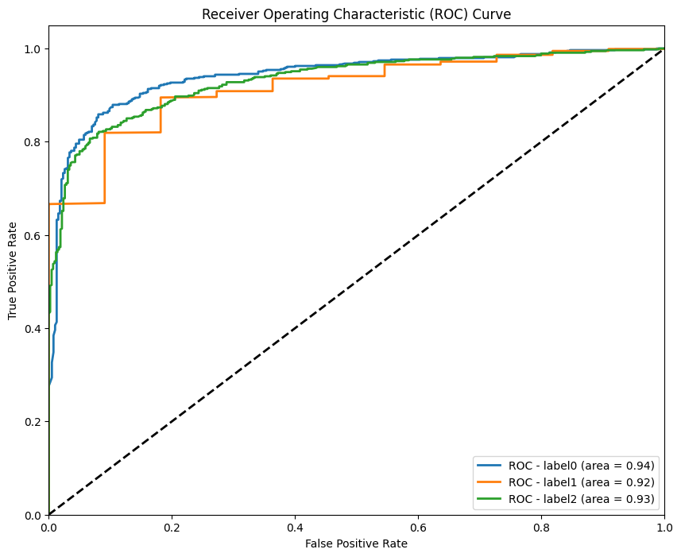
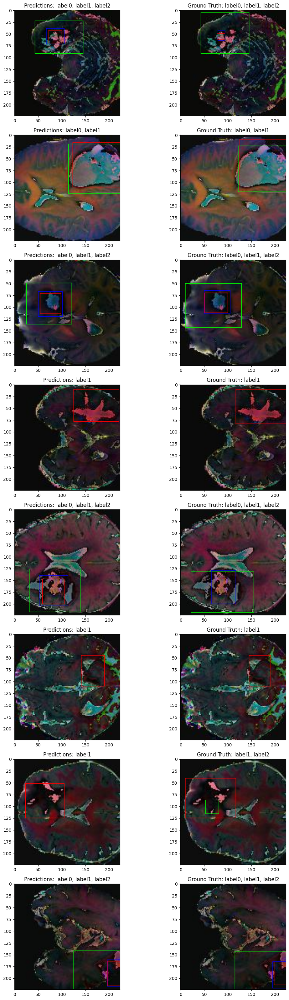

# 🧠 Brain Tumor Multi-Label Classification and Detection with ResNet101



## 🎯 Project Overview

This project focuses on developing a robust deep learning model for **multi-label classification and object detection of brain tumors** in medical images. Leveraging the power of the ResNet101 architecture, the model is trained to identify the presence of different tumor types and accurately locate them within the images. This work demonstrates the application of advanced computer vision techniques to a critical medical domain, potentially aiding in faster and more accurate diagnoses.

**Key Objectives:**
*   **Multi-Label Classification:** Identify the presence of multiple tumor types within a single image.
*   **Object Detection:** Accurately locate and delineate tumor regions using bounding boxes.
*   **High Accuracy:** Achieve high precision and recall in both classification and detection tasks.
*   **Robustness:** Develop a model that generalizes well to unseen data.

## ✨ Key Features
* **Dataset Download:**  Automatically download dataset from [Roboflow's brain-tumor-detectio dataset](https://universe.roboflow.com/yousef-ghanem-jzj4y/brain-tumor-detection-fpf1f.) (Please save API keys on `.env` file)
*   **Custom Loss Functions:**
    *   **IoU Loss:** Implemented a custom Intersection over Union (IoU) loss function ([`src/losses/iou_loss.py`](src/losses/iou_loss.py)) to optimize the accuracy of bounding box predictions.
    *   **Binary Weighted Loss:** Developed a custom binary weighted loss function (`src/losses/binary_weighted_loss.py`) to handle class imbalance and improve classification performance.
*   **ResNet101 Architecture:** Utilized the powerful ResNet101 model as a feature extractor, fine-tuning it for optimal performance on the brain tumor dataset.
    * **Dynamic Unfreezing:** Implemented dynamic unfreezing of ResNet101 layers during training, allowing for fine-tuning of a specific percentage of the network.
*   **Multi-Task Learning:** The model simultaneously performs classification and regression (bounding box prediction) in a single forward pass.
*   **Data Augmentation:** Implemented various data augmentation techniques (brightness, contrast, saturation, hue) to enhance model robustness and generalization.
*   **MLflow Integration:** Tracked experiments, logged metrics, and managed model artifacts using MLflow.
*   **Modular Design:** The code is organized into logical modules (data handling, models, losses, etc.) for better maintainability and readability.
*   **Clear Notebooks:** Provided Jupyter Notebooks for EDA, model building, and training.

## 🛠️ Technologies Used

*   **Python:** Core programming language.
*   **TensorFlow/Keras:** Deep learning framework.
*   **ResNet101:** Pre-trained convolutional neural network.
*   **Jupyter Notebook:** For exploratory data analysis (EDA), model development, and training.
*   **MLflow:** Experiment tracking and model management.
*   **TensorBoard:** Visualization of training and model performance.
*   **Hydra:** Configuration management.
*   **Roboflow:** Dataset management and download.
*   **Docker:** Containerization for consistent environment.
*   **VS Code Dev Containers:** Development environment setup.

## 📊 Model Training and Evaluation

The project includes detailed notebooks that guide you through the entire process:

1.  **Exploratory Data Analysis (EDA):** `01_exploratory_data_analyis_EDA.ipynb`
    *   Understand the dataset's characteristics.
    *   Visualize tumor distributions and image properties.
    *   Identify potential challenges (e.g., class imbalance).

2.  **Model Building (Classifier):** `02_classifier_building.ipynb`
    *   Design and implement the classification head of the model.
    *   Experiment with different architectures and hyperparameters.

3.  **Model Building (Regressor):** `03_regression_building.ipynb`
    *   Design and implement the bounding box regression head of the model.
    *   Experiment with different architectures and hyperparameters.

4.  **Model Training and Evaluation:** `04_model_building_training.ipynb`
    *   Data preprocessing and augmentation.
    *   Model architecture definition (ResNet101 with custom heads).
    *   Training pipeline setup with custom loss functions and metrics.
    *   Evaluation metrics (AUC, F1-score, IoU, MSE).
    *   Experiment tracking with MLflow.
    *   Visualization with TensorBoard.

## 🔧 Setup and Installation

1.  **Clone the Repository:**
    ```bash
    git clone https://github.com/vivekpatel99/brain-tumor-detection-transfer-learning.git
    cd brain-tumor-detection
    ```

2.  **Install VS Code Extensions:**
    *   Docker
    *   Dev Containers

3.  **Rebuild and Reopen in Container:**
    *   Press `Ctrl+Shift+P` (or `Cmd+Shift+P` on macOS).
    *   Select `Dev Containers: Rebuild and Reopen in Container`.

4.  **Environment Variables:**
    *   Create a `.env` file in the root directory.
    *   Add your Roboflow API key (if you want to download the dataset directly).
    *   Example:
        ```
        ROBOFLOW_API_KEY=
        ```


## 🖥️ Hardware Specifications

This project was developed and tested on the following hardware:

*   **CPU:** AMD Ryzen 5900X
*   **GPU:** NVIDIA GeForce RTX 3080 (10GB VRAM)
*   **RAM:** 32 GB DDR4

While these specifications are recommended for optimal performance, the project can be adapted to run on systems with less powerful hardware.

## 🚀 Detection Results: A Visual Showcase

The following visualizations demonstrate the model's ability to locate and classify brain tumors. These results are based on the model's performance on the validation dataset, providing insights into its generalization capabilities.

**Key Visual Elements:**

*   **IoU Score (Intersection over Union) Histogram:**
    *   **Description:** This histogram displays the distribution of IoU scores achieved by the model on the validation set. IoU is a critical metric for object detection, measuring the overlap between the predicted bounding box and the ground truth bounding box.
    *   **Interpretation:**
        *   **Higher bars on the right side (closer to 1.0):** Indicate a higher frequency of accurate bounding box predictions. This means the model is correctly localizing the tumors.
        *   **Higher bars on after 0.5 (more on left side):** are better. It means that most of the predictions are above 0.5 IoU, which is generally considered a good threshold for object detection.
        *   **Bars concentrated on the left side (closer to 0.0):** Suggest less accurate bounding box predictions, indicating that the model is struggling to precisely locate the tumors.
    *   **Goal:** The ideal histogram would show a large concentration of bars towards the right side (high IoU values), indicating precise localization.
    *   **Score:** higher bars on after 0.5 (more on left side) are better.
    *   **Visualization:**
        
*  **Classification Report:**
    |              | precision | recall | f1-score | support |
    | ------------ | --------- | ------ | -------- | ------- |
    | label0       | 0.94      | 0.85   | 0.90     | 588     |
    | label1       | 1.00      | 0.89   | 0.94     | 962     |
    | label2       | 0.95      | 0.78   | 0.86     | 554     |
    | micro avg    | 0.97      | 0.85   | 0.91     | 2104    |
    | macro avg    | 0.96      | 0.84   | 0.90     | 2104    |
    | weighted avg | 0.97      | 0.85   | 0.91     | 2104    |
    | samples avg  | 0.89      | 0.83   | 0.84     | 2104    |

*   **ROC Curve (Receiver Operating Characteristic Curve):**
    *   **Description:** The ROC curve illustrates the trade-off between the True Positive Rate (Sensitivity) and the False Positive Rate (1 - Specificity) at various classification thresholds. It's a fundamental tool for evaluating the performance of binary classification models.
    *   **Interpretation:**
        *   **Curve closer to the top-left corner:** Indicates better performance. A model with perfect classification ability would have a curve that goes straight up to the top-left corner and then horizontally to the right.
        *   **Curve closer to the diagonal line:** Suggests performance no better than random guessing.
        *   **Area Under the Curve (AUC):** The area under the ROC curve (AUC) is a single number that summarizes the overall performance. An AUC of 1.0 represents perfect classification, while an AUC of 0.5 represents random guessing.
    *   **Goal:** The goal is to achieve a ROC curve that hugs the top-left corner as closely as possible, with a corresponding high AUC value.
    *   **Visualization:**
        

*   **Final Result Images (Labels with Bounding Boxes):**
    *   **Description:** These images provide a visual representation of the model's final predictions on sample images from the validation set. They show the predicted bounding boxes around the tumors, along with the predicted tumor type labels.
    *   **Interpretation:**
        *   **Accurate Bounding Boxes:** The predicted bounding boxes should closely match the actual tumor regions.
        *   **Correct Labels:** The predicted tumor type labels should be accurate.
        *   **Confidence:** The model's confidence in its predictions can sometimes be inferred from the clarity and precision of the bounding boxes and labels.
    *   **Goal:** The goal is to see accurate bounding boxes that tightly enclose the tumors, along with correct tumor type labels.
    *   **Visualization:**
        


**Achieved Performance:**
* Training is done through multiple phases [04_model_building_training](notebooks/04_model_building_training.ipynb)
1. Finding Baseline performance through training only individual heads
    1. only classification head trainig [02_classifier_building](notebooks/02_classifier_building.ipynb)
    2. only regression head training [03_regression_building](notebooks/03_regression_building.ipynb)
2. Combine both heads and trained the model in 3 phases.
    1. Phase 1-Training only for Regression head (Bounding box) (with all the Trainable layers except classification)
    2. Phase 2-Training only for classification head (freezing all layers except classification=
    3. Phase 3-Training classification head + Regression head (with 150 trainable layers)


## 📚 References

This project draws inspiration and knowledge from the following resources:
* https://www.youtube.com/watch?v=8m3LvPg8EuI&t=110s 
* https://colab.research.google.com/drive/1klBxr93NYXrLFOVMXhm0RbVm5PIjfXQn#scrollTo=eqQe9NngQTar
