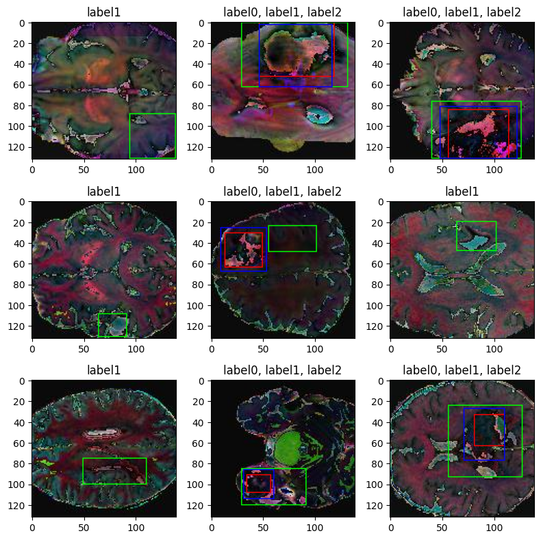

# 🧠 Brain Tumor Multi-Label Classification and Detection with ResNet101

[](reaadme-assets/title-img.png)

## 🎯 Project Overview

This project focuses on developing a robust deep learning model for **multi-label classification and object detection of brain tumors** in medical images. Leveraging the power of the ResNet101 architecture, the model is trained to identify the presence of different tumor types and accurately locate them within the images. This work demonstrates the application of advanced computer vision techniques to a critical medical domain, potentially aiding in faster and more accurate diagnoses.

**Key Objectives:**

*   **Multi-Label Classification:** Identify the presence of multiple tumor types within a single image.
*   **Object Detection:** Accurately locate and delineate tumor regions using bounding boxes.
*   **High Accuracy:** Achieve high precision and recall in both classification and detection tasks.
*   **Robustness:** Develop a model that generalizes well to unseen data.

## ✨ Key Features

*   **Custom Loss Functions:**
    *   **IoU Loss:** Implemented a custom Intersection over Union (IoU) loss function ([`src/losses/iou_loss.py`](src/losses/iou_loss.py)) to optimize the accuracy of bounding box predictions.
    *   **Binary Weighted Loss:** Developed a custom binary weighted loss function (`src/losses/binary_weighted_loss.py`) to handle class imbalance and improve classification performance.
*   **ResNet101 Architecture:** Utilized the powerful ResNet101 model as a feature extractor, fine-tuning it for optimal performance on the brain tumor dataset.
    * **Dynamic Unfreezing:** Implemented dynamic unfreezing of ResNet101 layers during training, allowing for fine-tuning of a specific percentage of the network.
*   **Multi-Task Learning:** The model simultaneously performs classification and regression (bounding box prediction) in a single forward pass.
*   **Data Augmentation:** Implemented various data augmentation techniques (brightness, contrast, saturation, hue) to enhance model robustness and generalization.
*   **MLflow Integration:** Tracked experiments, logged metrics, and managed model artifacts using MLflow.
*   **TensorBoard Integration:** Used TensorBoard for visualizing training progress, model architecture, and performance metrics.
*   **Modular Design:** The code is organized into logical modules (data handling, models, losses, etc.) for better maintainability and readability.
*   **Clear Notebooks:** Provided Jupyter Notebooks for EDA, model building, and training.

## 🛠️ Technologies Used

*   **Python:** Core programming language.
*   **TensorFlow/Keras:** Deep learning framework.
*   **ResNet101:** Pre-trained convolutional neural network.
*   **Jupyter Notebook:** For exploratory data analysis (EDA), model development, and training.
*   **MLflow:** Experiment tracking and model management.
*   **TensorBoard:** Visualization of training and model performance.
*   **Hydra:** Configuration management.
*   **Roboflow:** Dataset management and download.
*   **Docker:** Containerization for consistent environment.
*   **VS Code Dev Containers:** Development environment setup.

## 📊 Model Training and Evaluation

The project includes detailed notebooks that guide you through the entire process:

1.  **Exploratory Data Analysis (EDA):** `01_exploratory_data_analyis_EDA.ipynb`
    *   Understand the dataset's characteristics.
    *   Visualize tumor distributions and image properties.
    *   Identify potential challenges (e.g., class imbalance).

2.  **Model Building (Classifier):** `02_classifier_building.ipynb`
    *   Design and implement the classification head of the model.
    *   Experiment with different architectures and hyperparameters.

3.  **Model Building (Regressor):** `03_regression_building.ipynb`
    *   Design and implement the bounding box regression head of the model.
    *   Experiment with different architectures and hyperparameters.

4.  **Model Training and Evaluation:** `04_model_building_training.ipynb`
    *   Data preprocessing and augmentation.
    *   Model architecture definition (ResNet101 with custom heads).
    *   Training pipeline setup with custom loss functions and metrics.
    *   Evaluation metrics (AUC, F1-score, IoU, MSE).
    *   Experiment tracking with MLflow.
    *   Visualization with TensorBoard.

## 🔧 Setup and Installation

1.  **Clone the Repository:**
    ```bash
    git clone https://github.com/vivekpatel99/brain-tumor-detection-transfer-learning.git
    cd brain-tumor-detection
    ```

2.  **Install VS Code Extensions:**
    *   Docker
    *   Dev Containers

3.  **Rebuild and Reopen in Container:**
    *   Press `Ctrl+Shift+P` (or `Cmd+Shift+P` on macOS).
    *   Select `Dev Containers: Rebuild and Reopen in Container`.

4.  **Environment Variables:**
    *   Create a `.env` file in the root directory.
    *   Add your Roboflow API key (if you want to download the dataset directly).
    *   Example:
        ```
        ROBOFLOW_API_KEY=your_api_key_here
        ```

5.  **Configuration:**
    *   Open `conf/config.yaml` to adjust parameters like:
        *   Dataset paths (`DATASET_DIRS`)
        *   Image size (`IMG_SIZE`)
        *   Batch size (`BATCH_SIZE`)
        *   Learning rate (`LEARNING_RATE`)
        *   Number of epochs (`NUM_EPOCHS`)

## 🖥️ Hardware Specifications

This project was developed and tested on the following hardware:

*   **CPU:** AMD Ryzen 5900X
*   **GPU:** NVIDIA GeForce RTX 3080 (10GB VRAM)
*   **RAM:** 32 GB DDR4

While these specifications are recommended for optimal performance, the project can be adapted to run on systems with less powerful hardware.

## 🚀 Detection Results: A Visual Showcase

The following visualizations demonstrate the model's ability to locate and classify brain tumors.

**Key Visual Elements:**

*   **Title Metrics:**
    *   **Score:** Model's confidence in its prediction (higher is better).
    *   **IoU (Intersection over Union):** Overlap between predicted and ground truth boxes (closer to 1.0 is better).

!Object Detection Performance
*Note: Replace `reaadme-assets/detection_example.png` with an actual image.*

**Performance Insights:**

*   **High Score, High IoU:** Indicates accurate object localization and high confidence.
*   **High Score, Lower IoU:** Suggests the model confidently detects an object but with slight localization errors.
*   **Low Score, Low IoU:** Indicates a failure case where the model is not confident and the localization is poor.

**Achieved Performance:**

*   The model achieved a minimum loss of approximately **0.0264** on the validation set.
*   This was achieved with the following hyperparameters:
    ```python
    batch_size = 64 #changed from 32 to 64
    EPOCHS = 100 #changed from 50 to 100
    learning_rate = 1e-4
    ```

## 🔭 Future Improvements

*   **Loss Minimization:** Further reduce the loss to below `0.001` through:
    *   **Hyperparameter Tuning:** Experiment with different learning rates, optimizers, and regularization techniques.
    *   **Data Processing Pipeline Optimization:** Improve the efficiency and effectiveness of the `tf.data.Dataset` pipeline.
*   **Failure Case Analysis:** Investigate the model's failure cases to identify patterns and areas for improvement.
*   **Model Ensembling:** Combine multiple models to improve overall performance and robustness.
*   **Advanced Data Augmentation:** Explore more sophisticated augmentation techniques.
*   **Transfer Learning:** Experiment with different pre-trained models.
*   **Deployment:** Package the model for easy deployment as a web service or mobile app.

## 📚 References

This project draws inspiration and knowledge from the following resources:

*   **Class Imbalance:**
    * [CheXpert-multilabel-classification-tensorflow](https://github.com/tamerthamoqa/CheXpert-multilabel-classification-tensorflow)

* **GIoU loss:**
    * [tensorflow addonsg iou_loss](https://github.com/tensorflow/addons/blob/v0.20.0/tensorflow_addons/losses/giou_loss.py#L26-L61)
